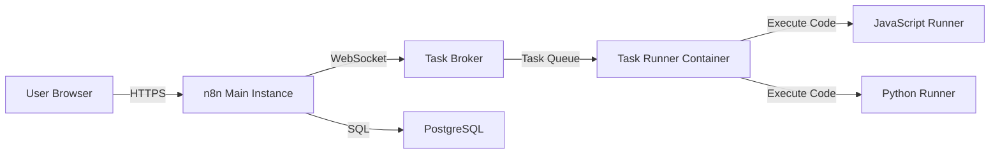

# n8n Railway Deployment Guide with Task Runners

## Table of Contents
- [Overview](#overview)
- [Architecture](#architecture)
- [Deployment Options](#deployment-options)
- [Option 1: Multi-Service Deployment (Recommended)](#option-1-multi-service-deployment-recommended)
- [Option 2: Custom Docker Image](#option-2-custom-docker-image)
- [Option 3: Template Fork and Modify](#option-3-template-fork-and-modify)
- [Adding Custom Dependencies](#adding-custom-dependencies)
- [Environment Variables Reference](#environment-variables-reference)
- [Troubleshooting](#troubleshooting)

## Overview

This guide explains how to deploy n8n with **task runner support** on Railway, enabling secure execution of custom JavaScript and Python code with custom dependencies.

### What are Task Runners?

Task runners are sidecar containers that:
- Execute user-provided code in the Code node
- Run in isolated environments separate from n8n
- Support both JavaScript (Node.js) and Python
- Allow custom npm packages and Python libraries

### Requirements

- **n8n version**: ≥ 1.111.0
- **Railway account**: Free tier provides $5/month credit
- **Images must match versions**: `n8nio/n8n` and `n8nio/runners` versions must be identical

## Architecture



**Components:**
1. **PostgreSQL** - Data persistence
2. **n8n Main** - Web UI, API, Task Broker
3. **Task Runners** - Code execution sidecar

## Deployment Options

### Option 1: Config-as-Code Deployment (Recommended)

**✅ Pros:** Full control over dependencies, Railway config-as-code, easy to maintain
**✅ Pros:** Dynamic dependency management via environment variables
**⚠️ Cons:** Requires GitHub repository connection

This is the approach used by the structure in this repository (`n8n/` and `runners/` folders).

#### How Railway Build Arguments Work

Railway automatically passes environment variables as Docker build arguments when they match `ARG` declarations in your Dockerfile.

**Example:**
1. Your Dockerfile has: `ARG JS_PACKAGES`
2. You set in Railway Dashboard: `JS_PACKAGES=moment@2.30.1,axios@^1.7.0`
3. Railway automatically runs: `docker build --build-arg JS_PACKAGES="moment@2.30.1,axios@^1.7.0" .`

**Important:** Railway does NOT support `[build.buildArgs]` in `railway.toml`. Always use environment variables in the Dashboard.

#### Step 1: Create PostgreSQL Database

1. Go to Railway Dashboard
2. Click "New Project" → "Provision PostgreSQL"
3. Note the database details (auto-configured)

#### Step 2: Deploy n8n Main Service

1. Create new service in the same project
2. Select "Deploy from Docker Image"
3. Image: `ghcr.io/n8n-io/n8n:latest`
4. Add environment variables:

```bash
# Database (use Railway's reference variables)
DB_TYPE=postgresdb
DB_POSTGRESDB_HOST=${{Postgres.RAILWAY_PRIVATE_DOMAIN}}
DB_POSTGRESDB_PORT=${{Postgres.PGPORT}}
DB_POSTGRESDB_DATABASE=${{Postgres.PGDATABASE}}
DB_POSTGRESDB_USER=${{Postgres.PGUSER}}
DB_POSTGRESDB_PASSWORD=${{Postgres.PGPASSWORD}}

# n8n Core Configuration
N8N_HOST=${{RAILWAY_PUBLIC_DOMAIN}}
N8N_PROTOCOL=https
N8N_PORT=5678
WEBHOOK_URL=https://${{RAILWAY_PUBLIC_DOMAIN}}/
N8N_ENCRYPTION_KEY=<GENERATE_RANDOM_STRING_32_CHARS>

# Task Runners Configuration
N8N_RUNNERS_ENABLED=true
N8N_RUNNERS_MODE=external
N8N_RUNNERS_BROKER_LISTEN_ADDRESS=0.0.0.0
N8N_RUNNERS_BROKER_PORT=5679
N8N_RUNNERS_AUTH_TOKEN=<GENERATE_SECURE_TOKEN>
N8N_NATIVE_PYTHON_RUNNER=true

# Logging
N8N_LOG_LEVEL=info
```

5. Enable public networking
6. Wait for deployment to complete

#### Step 3: Deploy Task Runners Service

1. Create another new service in the same project
2. Select "GitHub Repo"
3. Connect your repository
4. Set **Root Directory**: `railway-deployment/runners`
5. Railway will auto-detect `railway.toml` and `Dockerfile`
6. Add environment variables:

```bash
# BUILD-TIME Variables (Railway passes as --build-arg)
N8N_VERSION=latest
JS_PACKAGES=moment@2.30.1,axios@^1.7.0,lodash@^4.17.21
PY_PACKAGES=requests==2.31.0,python-dateutil==2.8.2

# RUNTIME Connection
N8N_RUNNERS_TASK_BROKER_URI=http://n8n.railway.internal:5679
N8N_RUNNERS_AUTH_TOKEN=<SAME_TOKEN_AS_N8N_MAIN>

# JavaScript Allow-Lists
JS_ALLOW_LIST=moment,axios,lodash
NODE_FUNCTION_ALLOW_BUILTIN=crypto,fs,path
NODE_FUNCTION_ALLOW_EXTERNAL=${{JS_ALLOW_LIST}}

# Python Allow-Lists
PY_ALLOW_LIST=requests,dateutil
PY_STDLIB_ALLOW=json,datetime,math,random
N8N_RUNNERS_EXTERNAL_ALLOW=${{PY_ALLOW_LIST}}
N8N_RUNNERS_STDLIB_ALLOW=${{PY_STDLIB_ALLOW}}

# Performance
N8N_RUNNERS_MAX_CONCURRENCY=5
N8N_RUNNERS_TASK_TIMEOUT=60
N8N_RUNNERS_LAUNCHER_LOG_LEVEL=info

# Timezone
GENERIC_TIMEZONE=America/New_York
```

**Two-Variable System Explained:**
- **BUILD-TIME** (`JS_PACKAGES`, `PY_PACKAGES`): Install packages with versions
- **RUNTIME** (`JS_ALLOW_LIST`, `PY_ALLOW_LIST`): Enable packages without versions

7. **DO NOT enable public networking** (internal only)
8. Deploy

#### Step 4: Verify Deployment

1. Access n8n via the public domain
2. Create a workflow with a Code node
3. Test JavaScript code:
```javascript
const moment = require('moment');
return [{ json: { time: moment().format() } }];
```

4. Test Python code:
```python
import json
return [{'json': {'message': 'Python works!'}}]
```

### Option 2: Official Image Deployment (Simple)

**✅ Pros:** Easiest to maintain, easy to update, no custom images
**⚠️ Cons:** Limited to pre-installed packages in official `n8nio/runners` image

#### Step 1: Create PostgreSQL Database

1. Go to Railway Dashboard
2. Click "New Project" → "Provision PostgreSQL"
3. Note the database details (auto-configured)

#### Step 2: Deploy n8n Main Service

1. Create new service in the same project
2. Select "Deploy from Docker Image"
3. Image: `ghcr.io/n8n-io/n8n:latest`
4. Add environment variables:

```bash
# Database (use Railway's reference variables)
DB_TYPE=postgresdb
DB_POSTGRESDB_HOST=${{Postgres.PGHOST}}
DB_POSTGRESDB_PORT=${{Postgres.PGPORT}}
DB_POSTGRESDB_DATABASE=${{Postgres.PGDATABASE}}
DB_POSTGRESDB_USER=${{Postgres.PGUSER}}
DB_POSTGRESDB_PASSWORD=${{Postgres.PGPASSWORD}}

# n8n Core Configuration
N8N_HOST=${{RAILWAY_PUBLIC_DOMAIN}}
N8N_PROTOCOL=https
N8N_PORT=5678
WEBHOOK_URL=https://${{RAILWAY_PUBLIC_DOMAIN}}/
N8N_ENCRYPTION_KEY=<GENERATE_RANDOM_STRING_32_CHARS>

# Task Runners Configuration
N8N_RUNNERS_ENABLED=true
N8N_RUNNERS_MODE=external
N8N_RUNNERS_BROKER_LISTEN_ADDRESS=0.0.0.0
N8N_RUNNERS_BROKER_PORT=5679
N8N_RUNNERS_AUTH_TOKEN=<GENERATE_SECURE_TOKEN>
N8N_NATIVE_PYTHON_RUNNER=true

# Logging
N8N_LOG_LEVEL=info
```

5. Enable public networking
6. Wait for deployment to complete

#### Step 3: Deploy Task Runners Service

1. Create another new service in the same project
2. Select "Deploy from Docker Image"
3. Image: `ghcr.io/n8n-io/runners:latest`
4. Add environment variables:

```bash
# Task Broker Connection
N8N_RUNNERS_TASK_BROKER_URI=http://n8n.railway.internal:5679
N8N_RUNNERS_AUTH_TOKEN=<SAME_TOKEN_AS_N8N_MAIN>

# Launcher Configuration
N8N_RUNNERS_LAUNCHER_LOG_LEVEL=info

# Allowed Packages (CRITICAL - customize this)
NODE_FUNCTION_ALLOW_EXTERNAL=moment
N8N_RUNNERS_EXTERNAL_ALLOW=

# Performance
N8N_RUNNERS_MAX_CONCURRENCY=5
N8N_RUNNERS_TASK_TIMEOUT=60

# Timezone
GENERIC_TIMEZONE=America/New_York
```

5. **DO NOT enable public networking** (internal only)
6. Deploy

#### Step 4: Verify Deployment

1. Access n8n via the public domain
2. Create a workflow with a Code node
3. Test JavaScript code:
```javascript
const moment = require('moment');
return [{ json: { time: moment().format() } }];
```

4. Test Python code:
```python
import json
return [{'json': {'message': 'Python works!'}}]
```

### Option 3: Custom Docker Image (Manual Build)

**⚠️ Deprecated:** Use Option 1 (Config-as-Code) instead for easier maintenance

**✅ Pros:** Full control over dependencies, can add ANY package
**⚠️ Cons:** Requires building and hosting custom images, manual updates

#### Step 1: Build Custom Runners Image

Use the `runners/Dockerfile` from this repository:

```bash
# From repository root
cd railway-deployment/runners

# Build for your platform
docker buildx build \
  --platform linux/amd64 \
  --build-arg N8N_VERSION=latest \
  --build-arg JS_PACKAGES="moment@2.30.1,axios@^1.7.0,lodash@^4.17.21" \
  --build-arg PY_PACKAGES="requests==2.31.0,python-dateutil==2.8.2" \
  -t your-dockerhub-username/n8n-runners:custom \
  --push \
  .
```

**Or use GitHub Actions to build automatically:**

```yaml
# .github/workflows/build-runners.yml
name: Build Custom Runners
on:
  push:
    paths:
      - 'railway-deployment/runners/Dockerfile'

jobs:
  build:
    runs-on: ubuntu-latest
    steps:
      - uses: actions/checkout@v3

      - name: Login to GHCR
        uses: docker/login-action@v2
        with:
          registry: ghcr.io
          username: ${{ github.actor }}
          password: ${{ secrets.GITHUB_TOKEN }}

      - name: Build and Push
        uses: docker/build-push-action@v4
        with:
          context: railway-deployment/runners
          file: railway-deployment/runners/Dockerfile
          push: true
          tags: ghcr.io/${{ github.repository }}/n8n-runners:custom
          build-args: |
            N8N_VERSION=latest
            JS_PACKAGES=moment@2.30.1,axios@^1.7.0,lodash@^4.17.21
            PY_PACKAGES=requests==2.31.0,python-dateutil==2.8.2
```

#### Step 2: Deploy on Railway

Follow "Option 2" (Official Image) steps but use your custom image:
- Image: `your-dockerhub-username/n8n-runners:custom`
- Update environment variables to match packages in your Dockerfile

### Option 4: Template Fork and Modify

**✅ Pros:** Uses Railway templates, infrastructure-as-code
**⚠️ Cons:** More complex setup, template maintenance

1. Fork the Railway template repository:
   - https://github.com/railwayapp-templates/n8n

2. Modify the configuration to add runners service

3. Deploy your forked template

## Adding Custom Dependencies

### Using Config-as-Code (Option 1 - Recommended)

Railway uses a **two-variable system** for dependencies:

1. **BUILD-TIME**: Install packages (with versions)
2. **RUNTIME**: Enable packages (without versions)

#### JavaScript/Node.js Packages

Go to Railway Dashboard → Runners Service → Variables:

**Step 1: Update BUILD-TIME variable (install package)**
```bash
JS_PACKAGES=moment@2.30.1,axios@^1.7.0,lodash@^4.17.21,uuid@^9.0.0
```

**Step 2: Update RUNTIME variable (enable usage)**
```bash
JS_ALLOW_LIST=moment,axios,lodash,uuid
NODE_FUNCTION_ALLOW_EXTERNAL=${{JS_ALLOW_LIST}}
```

**Step 3: Redeploy**
- Click "Redeploy" button in Railway Dashboard
- Railway rebuilds with new packages

**No git commit needed** - all changes are in Railway Dashboard.

#### Python Packages

Go to Railway Dashboard → Runners Service → Variables:

**Step 1: Update BUILD-TIME variable (install package)**
```bash
PY_PACKAGES=requests==2.31.0,python-dateutil==2.8.2,beautifulsoup4==4.12.3
```

**Step 2: Update RUNTIME variable (enable usage)**
```bash
PY_ALLOW_LIST=requests,dateutil,bs4
N8N_RUNNERS_EXTERNAL_ALLOW=${{PY_ALLOW_LIST}}
```

⚠️ **Note:** Package install names may differ from import names:
- `python-dateutil` installs as `python-dateutil` but imports as `dateutil`
- `beautifulsoup4` installs as `beautifulsoup4` but imports as `bs4`

**Step 3: Redeploy**
- Click "Redeploy" button in Railway Dashboard
- Railway rebuilds with new packages

### Using Official Image (Option 2)

**Limited to pre-installed packages only.**

Check available packages:
```bash
# JavaScript
docker run --rm ghcr.io/n8n-io/runners:latest ls /opt/runners/task-runner-javascript/node_modules

# Python
docker run --rm ghcr.io/n8n-io/runners:latest ls /opt/runners/task-runner-python/.venv/lib/python*/site-packages
```

Enable packages via environment variables:
```bash
NODE_FUNCTION_ALLOW_EXTERNAL=moment,axios,lodash
N8N_RUNNERS_EXTERNAL_ALLOW=requests,dateutil
```

### Using Custom Dockerfile (Option 3)

Edit `runners/Dockerfile` and modify the build args or hardcode dependencies, then rebuild and push your custom image.

## Environment Variables Reference

### n8n Main Instance

| Variable | Required | Description | Example |
|----------|----------|-------------|---------|
| `DB_TYPE` | ✅ | Database type | `postgresdb` |
| `DB_POSTGRESDB_HOST` | ✅ | Database host | `${{Postgres.PGHOST}}` |
| `DB_POSTGRESDB_PORT` | ✅ | Database port | `${{Postgres.PGPORT}}` |
| `DB_POSTGRESDB_DATABASE` | ✅ | Database name | `${{Postgres.PGDATABASE}}` |
| `DB_POSTGRESDB_USER` | ✅ | Database user | `${{Postgres.PGUSER}}` |
| `DB_POSTGRESDB_PASSWORD` | ✅ | Database password | `${{Postgres.PGPASSWORD}}` |
| `N8N_HOST` | ✅ | Public domain | `${{RAILWAY_PUBLIC_DOMAIN}}` |
| `N8N_PROTOCOL` | ✅ | Protocol | `https` |
| `WEBHOOK_URL` | ✅ | Webhook URL | `https://${{RAILWAY_PUBLIC_DOMAIN}}/` |
| `N8N_ENCRYPTION_KEY` | ✅ | Encryption key | Generate random 32+ chars |
| `N8N_RUNNERS_ENABLED` | ✅ | Enable runners | `true` |
| `N8N_RUNNERS_MODE` | ✅ | Runner mode | `external` |
| `N8N_RUNNERS_BROKER_LISTEN_ADDRESS` | ✅ | Broker address | `0.0.0.0` |
| `N8N_RUNNERS_AUTH_TOKEN` | ✅ | Auth token | Generate secure token |
| `N8N_NATIVE_PYTHON_RUNNER` | ✅ | Enable Python | `true` |

### Task Runners Instance

| Variable | Required | Description | Example |
|----------|----------|-------------|---------|
| `N8N_RUNNERS_TASK_BROKER_URI` | ✅ | Broker URI | `http://n8n.railway.internal:5679` |
| `N8N_RUNNERS_AUTH_TOKEN` | ✅ | Auth token (same as main) | Same as n8n main |
| `NODE_FUNCTION_ALLOW_EXTERNAL` | ⚠️ | Allowed JS packages | `moment,axios` |
| `NODE_FUNCTION_ALLOW_BUILTIN` | ⚠️ | Allowed Node builtins | `crypto,fs,path` |
| `N8N_RUNNERS_EXTERNAL_ALLOW` | ⚠️ | Allowed Python packages | `numpy,pandas` |
| `N8N_RUNNERS_STDLIB_ALLOW` | ⚠️ | Allowed Python stdlib | `json,datetime` |
| `N8N_RUNNERS_MAX_CONCURRENCY` | ❌ | Max concurrent tasks | `5` |
| `N8N_RUNNERS_TASK_TIMEOUT` | ❌ | Task timeout (seconds) | `60` |

⚠️ = Critical for security and functionality

## Updating Dependencies on Railway

### Config-as-Code Deployment (Option 1 - Recommended)

**Update process:**

1. Go to Railway Dashboard → Runners Service → Variables
2. Update `JS_PACKAGES` or `PY_PACKAGES` (with versions)
3. Update `JS_ALLOW_LIST` or `PY_ALLOW_LIST` (without versions)
4. Click "Redeploy"

**Example - Adding uuid package:**

Before:
```bash
JS_PACKAGES=moment@2.30.1,axios@^1.7.0,lodash@^4.17.21
JS_ALLOW_LIST=moment,axios,lodash
```

After:
```bash
JS_PACKAGES=moment@2.30.1,axios@^1.7.0,lodash@^4.17.21,uuid@^9.0.0
JS_ALLOW_LIST=moment,axios,lodash,uuid
```

**No git commit needed** - Railway rebuilds automatically with new packages.

### Official Image Deployment (Option 2)

**Cannot add new packages** - only enable/disable pre-installed ones.

To update:
1. Check available packages: `docker run --rm ghcr.io/n8n-io/runners:latest ls /opt/runners/task-runner-javascript/node_modules`
2. Update `NODE_FUNCTION_ALLOW_EXTERNAL` environment variable
3. Restart the runners service

### Custom Image Deployment (Option 3)

1. Update `runners/Dockerfile` with new dependencies
2. Rebuild and push image:
```bash
cd railway-deployment/runners
docker buildx build --platform linux/amd64 \
  --build-arg JS_PACKAGES="moment@2.30.1,axios@^1.7.0,uuid@^9.0.0" \
  -t your-registry/n8n-runners:custom \
  --push .
```
3. Redeploy on Railway (automatic if watching image)

**Alternative:** Use Railway's automatic deployments with GitHub:
1. Push Dockerfile changes to GitHub
2. Railway auto-rebuilds
3. Update environment variables if needed

## Troubleshooting

### Task Runner Not Connecting

**Symptom:** Code nodes timeout or fail to execute

**Solutions:**
1. Check auth token matches:
```bash
# In n8n service
echo $N8N_RUNNERS_AUTH_TOKEN

# In runners service
echo $N8N_RUNNERS_AUTH_TOKEN
```

2. Verify broker URI uses Railway internal networking:
```bash
N8N_RUNNERS_TASK_BROKER_URI=http://n8n.railway.internal:5679
# NOT the public domain!
```

3. Check n8n logs:
```bash
railway logs -s n8n
```

Look for: `Task broker listening on 0.0.0.0:5679`

4. Check runners logs:
```bash
railway logs -s runners
```

Look for: `Connected to task broker`

### Package Not Found

**Symptom:** Code execution fails with "Cannot find module 'package-name'"

**Solutions:**

1. **Using official image:** Package must be in allow list AND pre-installed:
```bash
# Check if package exists
railway run -s runners ls /opt/runners/task-runner-javascript/node_modules | grep package-name
```

2. **Using custom image:** Verify package in Dockerfile and env config match:
```dockerfile
# In Dockerfile
"dependencies": {
  "package-name": "^1.0.0"
}
```
```bash
# In Railway env vars
NODE_FUNCTION_ALLOW_EXTERNAL=package-name,other-package
```

3. Rebuild custom image if package was just added

### Python Runner Not Working

**Symptom:** Python code nodes fail

**Solutions:**

1. Enable Python runner on n8n main:
```bash
N8N_NATIVE_PYTHON_RUNNER=true
```

2. Check Python is available in runners:
```bash
railway run -s runners /opt/runners/task-runner-python/.venv/bin/python --version
```

3. Verify Python packages:
```bash
railway run -s runners /opt/runners/task-runner-python/.venv/bin/pip list
```

### Version Mismatch

**Symptom:** Runners fail to start or connect

**Solutions:**

1. Ensure versions match exactly:
```bash
# n8n main
docker pull ghcr.io/n8n-io/n8n:1.75.0

# runners
docker pull ghcr.io/n8n-io/runners:1.75.0
```

2. Use version tags instead of `latest`:
```bash
# Railway service config
Image: ghcr.io/n8n-io/n8n:1.75.0
Image: ghcr.io/n8n-io/runners:1.75.0
```

### Memory/CPU Issues

**Symptom:** Slow execution, timeouts, container restarts

**Solutions:**

1. Upgrade Railway plan for more resources
2. Reduce concurrency:
```bash
N8N_RUNNERS_MAX_CONCURRENCY=2
```
3. Increase task timeout:
```bash
N8N_RUNNERS_TASK_TIMEOUT=120
```

## Security Best Practices

1. **Use strong encryption key:**
```bash
# Generate secure key
openssl rand -base64 32
```

2. **Restrict allowed packages:**
Only allow packages you actually need:
```bash
NODE_FUNCTION_ALLOW_EXTERNAL=moment,axios
# NOT: NODE_FUNCTION_ALLOW_EXTERNAL=*
```

3. **Keep versions updated:**
Monitor n8n releases and update regularly

4. **Use secrets for sensitive env vars:**
Railway auto-encrypts environment variables, but use Railway's secret management for extra security

## Cost Optimization

**Free Tier Considerations:**
- Railway: $5/month free credit
- Estimated usage: ~$10-20/month for full stack
  - PostgreSQL: $5-8/month
  - n8n Main: $3-7/month
  - Runners: $2-5/month

**Cost Reduction Tips:**
1. Use SQLite instead of PostgreSQL (not recommended for production)
2. Scale down during off-hours
3. Use starter templates with lower resource limits

## Additional Resources

- [n8n Task Runners Documentation](https://docs.n8n.io/hosting/configuration/task-runners/)
- [n8n Environment Variables](https://docs.n8n.io/hosting/configuration/environment-variables/task-runners/)
- [Railway Documentation](https://docs.railway.com/)
- [Task Runner Launcher](https://github.com/n8n-io/task-runner-launcher)

## Support

- n8n Community Forum: https://community.n8n.io
- Railway Help Station: https://station.railway.com
- n8n Discord: https://discord.gg/n8n

---

**Last Updated:** 2025-10-22
**n8n Version:** ≥ 1.111.0
**Status:** Task runners are STABLE (JavaScript), BETA (Python)
